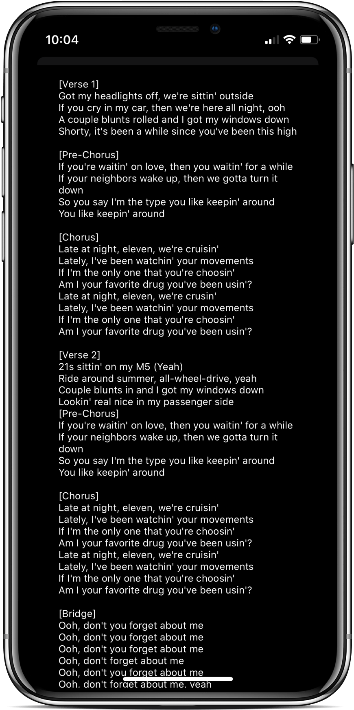

```
███╗   ███╗ █████╗ ███████╗ █████╗ ██╗  ██╗███████╗
████╗ ████║██╔══██╗╚══███╔╝██╔══██╗██║  ██║██╔════╝
██╔████╔██║███████║  ███╔╝ ███████║███████║███████╗
██║╚██╔╝██║██╔══██║ ███╔╝  ██╔══██║██╔══██║╚════██║
██║ ╚═╝ ██║██║  ██║███████╗██║  ██║██║  ██║███████║
╚═╝     ╚═╝╚═╝  ╚═╝╚══════╝╚═╝  ╚═╝╚═╝  ╚═╝╚══════╝                                               
```                                                                             

**MAZAHS is an App that utilizes [Audd's music recognition API](https://audd.io/) to provide music recognition and lyric tools to music-lovers.**

## Features
1. Music Recognition from Recording (Available 1.17.20)
2. Music Recognition from Humming (Coming Soon)
3. Music Recognition from Typing Lyrics (Coming Soon)
4. View Lyrics for a Song (Coming Soon)

## Screenshots
   

Dave Ho - JAN 2020
